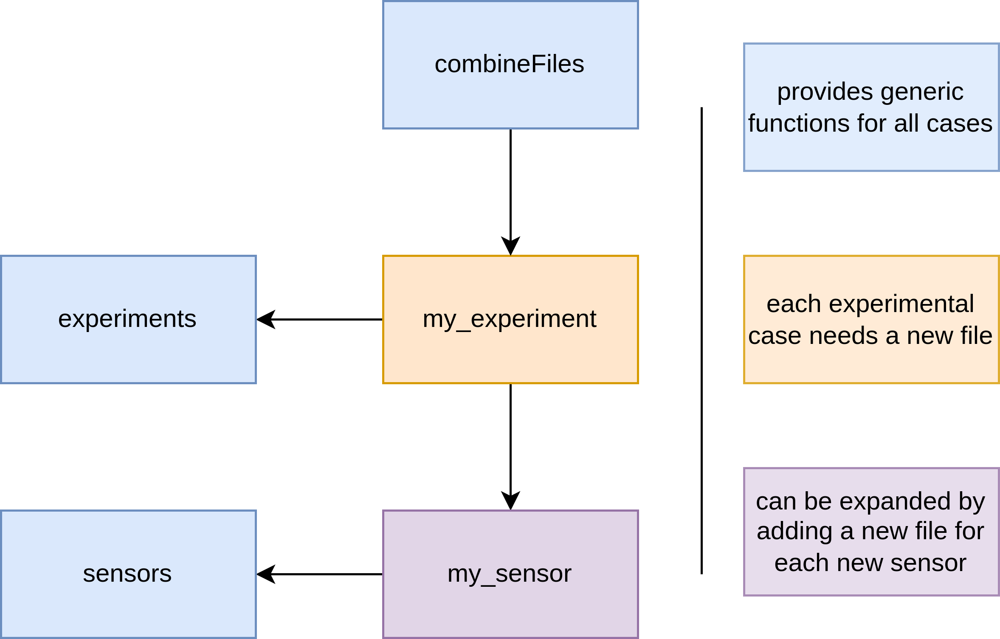

# Strike Rig Data Combiner

This Python package combines measurements from sensors using [xarray](https://docs.xarray.dev/en/stable/index.html). Xarray is a Python library that organizes data along labeled axes, making data processing more intuitive and clear. You could describe it as an n-dimensional Pandas.

The package combines data from multiple sensors within a trial, such as servocontroller feedback and sensor probe acceleration measurements, and projects it into a single frame of reference. It can perform region of interest (ROI) cropping and align datasets to one another.

This software is not designed as a standalone package like NumPy or Pandas, where you exclusively use provided functions. Instead, it is meant to be actively worked on within the package. The package structure facilitates access to its components, as importing files across directories would otherwise be cumbersome.

This software was used in the following publication, available as a preprint:

[An Open Laboratory Blade Strike Rig to Evaluate the Risk of Injury and Mortality to Fish and to Test Passive Sensors](https://dx.doi.org/10.2139/ssrn.5111056)

## Installation

1. Download or clone the repository.
2. Move it to the desired location.
3. Install [Miniconda](https://www.anaconda.com/docs/getting-started/miniconda/main)
4. Install the Python dependencies using the `REQUIREMENTS` file:
   ```bash
   conda create --name <env> --file REQUIREMENTS
   ```
5. Install the package in editable mode by running the following command inside the folder:
   ```bash
   pip install -e srdatacombiner
   ```

Installing in editable mode (`-e`) ensures that any changes made within the package (e.g., implementing a new sensor) are directly reflected in your environment. For example, you can load a sensor in another Python file via:
```python
from srdatacombiner.sensors.mysensor import MySensor
```

## Structure

The package structure is as follows:

- **combineFiles**: Iterates through files using glob strings provided by the `my_experiment` file and creates an empty dataset to be filled with data. This dataset builds a grid using folder names. A custom function in the `my_experiment` file translates folder names into corresponding numbers. Missing points along the coordinates are filled by NaNs.
- **my_experiment**: Defines experiment-specific configurations, such as data loading, folder-to-coordinate translation, axis naming, sensor usage, interpolation master dataset, ROI cropping, and data alignment. Sensor configurations are initialized within the experiment class and stored in a dictionary for centralized access.
- **my_sensor**: Handles raw sensor data import and preprocessing. Avoid implementing unnecessary filtering here; instead, perform filtering in the `my_experiment` file to adapt it to specific experiment needs. Metadata, such as sensor name and range, should be added here for convenience.
- **experiments & sensors**: Abstract classes providing shared functionality for experiment and sensor files. Avoid modifying these classes, as changes may break other use cases.



The program is executed from individual experiment files. The code at the bottom of these files, under:
```python
if __name__ == "__main__":
```
ensures that this part of the program is only run when the file itself is executed, not when it is imported into another file.

## How to Use It

Follow this workflow for loading data from a new experiment:

1. Load one dataset from the sensor file and verify its correctness.
2. Develop a preliminary ROI cropping algorithm using the loaded data.
3. Repeat this process for other sensors.
4. Transfer the algorithms to a function and include it in the custom experiments file.
5. Complete the experiments file, ensuring files are loaded in the correct order.
6. Develop a function to align sensors along a chosen axis (e.g., time) using a common event (e.g., impact).
7. Perform a test import of the data. If ROI cropping fails, investigate whether the cropping method needs improvement or if the data is corrupt.
8. Verify that sensor alignment works as expected.
9. Add any additional metadata to save with the file.
10. Save the data importing the `save_as_h5` function by importing it like this:
   ```python
   from srdatacombiner.helper_scripts.xarray_tools import save_as_h5
   ```
   This function compresses the data.

## Tips

You may use the `#%%` command in VS Code to enable cell execution, similar to MATLAB.

## Caveats

The sensor class `phantom_video`, which imports high-speed videos in the `*.cine` format, is not actively maintained and may contain bugs. It requires the `dask` package for efficient computation, significantly reducing memory requirements through lazy loading and execution.

## Strike Trajectory Estimation

The directory `srdatacombiner/helper_scripts/Strike_Trajectory_Estimation` contains code used to estimate motor power and distance requirements during the development of the RETERO strike rig. It is a standalone module and not directly integrated with the rest of the package.

- `ode.py`: Core module that performs trajectory calculations by integrating acceleration in three phases—acceleration, constant velocity, and deceleration.
- `test_newDrivechain.py`: Example script demonstrating how to run new simulations with custom parameters using the functionality from `ode.py`.
- `find_ode_params.py`: Script used to estimate parameters such as friction and fluid drag to improve the accuracy of the trajectory. These estimates were based on empirical measurements from the physical strike rig and are incorporated into the trajectory calculations in `ode.py` .

