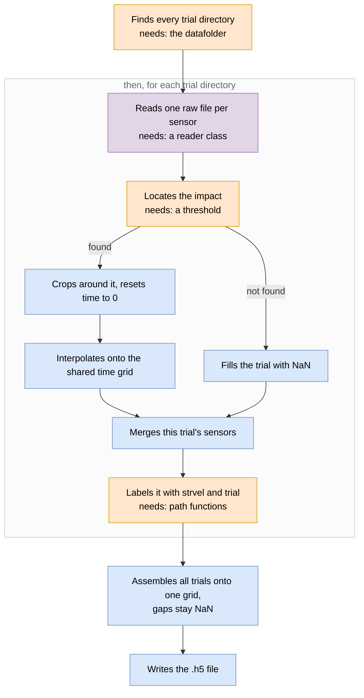

# srdatacombiner

**Strike Rig Data Combiner**

[](LICENSE)
[](https://www.python.org/)

The strike rig itself, its design rationale and its validation are documented in:

Kösters, W.I., Tuhtan, J.A., Efimov, D., Kruusmaa, M., Hoerner, S. (2025).
*An open laboratory blade strike rig to evaluate the risk of injury and mortality to fish
and to test passive sensors.* Sustainable Energy Technologies and Assessments, 81, 104427.
[10.1016/j.seta.2025.104427](https://doi.org/10.1016/j.seta.2025.104427)

## Scope

This package turns the raw files of a blade strike campaign into a single labelled dataset.
Every trial is located by strike velocity and trial number, cropped to a common window around
its own impact and mapped onto a shared time axis, so that sensor probes, strike velocities
and repetitions become directly comparable and every value remains traceable to the raw file
it came from.

The reconciliation is needed because every trial is recorded twice. The probe logs
acceleration, angular rate and pressure on its own clock, and the rig instrumentation reports
carriage velocity and position at the moment of impact. The two recordings differ in sampling
rate, clock origin and file format, and are related to one another only by the directory in
which they were stored.

The measurements come from a laboratory rig that strikes a sensor probe with a blade at a
known velocity, in 1 m/s steps with up to 30 repetitions per velocity. They exist to test the
strike severity metrics that infer fish injury risk from a probe recording: each metric is
computed per trial and read against the velocity that produced it, which shows over what
range the metric still responds to how hard the probe was hit. The combined dataset is the
input to those metrics under `analyze/metrics/` and the format in which the measurements are
archived.

## Data availability

| Record | Contents |
| --- | --- |
| [Figure Data](https://doi.org/10.5281/zenodo.15078903) | Measurements underlying Figures 4 to 6 of Kösters et al. (2025). Raw measurement data as ZIP files, aligned and combined datasets as HDF5. |
| [Supplementary Data](https://doi.org/10.5281/zenodo.15864852) | High-speed video of the fish dummy and of the rigid RAPID probe struck at 5 m/s, filmed from below and from the side, plus one strike at normal speed. |
| [CAD Data](https://doi.org/10.5281/zenodo.15078946) | CAD files of the rig, for Autodesk Inventor 2024 or higher. |

Reading a combined dataset requires nothing from this package:

```python
import xarray as xr
ds = xr.load_dataset("25_05_28_4sensors.h5")
```

Re-running an experiment file on the corresponding raw measurement directory reproduces the
HDF5 file for that campaign, which is the intended way to verify an installation against
data of known content. The experiment files expect the measurement directories under a `data/`
directory adjacent to the package; the `datafolder` argument has to be adjusted if they are
placed elsewhere. Measurement directory names encode probe, blade, velocity range and blade
force, as in `24_08_08_RAPIDv1_9.5mmBlade_1mpsSteps_1to10mps_30N`.

## Terminology

A **sensor probe** is an instrumented body exposed to the blade: the Sensor Fish, the RAPID,
the BDS, the Stickfish or the OvGU fish. A probe carries several **sensors**, the individual
accelerometers, gyroscopes, pressure sensors and magnetometers from which its data variables
originate. The `Sensor` attribute of each variable names the component rather than the probe.

**Rig instrumentation** covers everything recording the rig rather than the probe. That is
the high-speed camera and the servo drive scope export, which yields carriage velocity,
position and motor current.

The `sensors/` module holds the readers for both, one class per data source. The distinction
is made in the experiment file, where the two are configured as `Sensorprobe` and `Scope`.

## Installation

Python 3.11 or newer. Nothing beyond the standard library is required to create the
environment.

```bash
git clone https://github.com/ikoesters/srdatacombiner.git
cd srdatacombiner
python -m venv .venv
source .venv/bin/activate      # Windows: .venv\Scripts\activate
pip install -e .
```

Editable installation is deliberate: the package is intended to be extended in place (see
[Intended use](#intended-use)), and a newly added reader is then importable without
reinstalling.

```python
from srdatacombiner.sensors.myprobe import MyProbe
```

Optional extras, neither needed for the strike analysis:

```bash
pip install -e ".[video]"        # reading *.cine high-speed video
pip install -e ".[orientation]"  # BDS absolute-orientation rotation
```

With [uv](https://docs.astral.sh/uv/), `uv venv && uv pip install -e .` is equivalent and
faster.

### Reproducing the original environment

The installation above takes current versions of each dependency, which is what most uses
want. To reproduce the archived results instead, `requirements.txt` pins the exact versions
of the environment used for the analysis, under Python 3.11.5:

```bash
python3.11 -m venv .venv && source .venv/bin/activate
pip install -r requirements.txt
pip install -e . --no-deps
```

It installs on any platform.

## Resulting dataset

Applying the procedure below to a five-velocity sweep yields a dataset of the following form
(abridged):

```
<xarray.Dataset>
Dimensions:      (strvel: 5, trial: 10, time: 210)
Coordinates:
  * strvel       (strvel) float64 1.0 2.0 3.0 4.0 5.0      # strike velocity, m/s
  * trial        (trial) int64 1 2 3 4 5 6 7 8 9 10        # repetition at that velocity
  * time         (time) float64 0.0 0.0005 ... 0.1045      # impact at t = 0.005 s
Data variables:
    accx         (strvel, trial, time) float64 ...          # sensor probe
    accy         (strvel, trial, time) float64 ...
    accz         (strvel, trial, time) float64 ...
    accmag       (strvel, trial, time) float64 ...
    gyrox        (strvel, trial, time) float64 ...
    pres         (strvel, trial, time) float64 ...
    vel          (strvel, trial, time) float64 ...          # rig, carriage velocity, m/s
    pos          (strvel, trial, time) float64 ...          # rig, carriage position, m
    curr         (strvel, trial, time) float64 ...          # rig, motor current, A
    sensorprobe  (strvel, trial) <U88 ...                   # source file of each cell
    servoscope   (strvel, trial) <U88 ...
```

`strvel` and `trial` are read from the directory names. The variables `sensorprobe` and
`servoscope` carry the labels assigned in the experiment file and hold the path of the raw
file each cell was read from, so an anomalous trace can be traced back to its source.

Each trial is cropped to an identical window around its own impact and the window is then
reset to begin at zero, so impact occupies the same index in every trial and
`ds.sel(strvel=3).accmag.plot(hue="trial")` superimposes the repetitions in phase.

Accelerations are in m/s² throughout, the internal unit of the package; divide by 9.81 for g.
Units and the originating sensor are attached to every variable:

```python
>>> ds.pres.attrs
{'Unit': 'mBar', 'Range': '+/- 2000', 'Sensor': 'TE Connectivity MS5837-2BA'}
```

## Usage

A complete run, from a directory of raw files to a compressed HDF5 dataset, is
`srdatacombiner/experiments/strikes/bds_strikes.py`:

```python
from pathlib import Path

from srdatacombiner.combineFiles import CombineFiles
from srdatacombiner.experiments.strikes.strikes import Scope, Sensorprobe, Strikes
from srdatacombiner.helper_scripts.xarray_tools import save_as_h5
from srdatacombiner.sensors.taltech import BDS250

curr_dir = Path(__file__).parent
resample_rate = 2000

# Sensor probe. Impact is the first sample at which the acceleration magnitude
# measured by its accelerometers exceeds 75 m/s^2.
sp = Sensorprobe(
    processor=BDS250,
    file_glob="*.txt",
    sample_rate=resample_rate,
    thresh_acc_cuttoimpact=75,
    sensor_kwargs={"resample_rate": resample_rate},
)

# Rig instrumentation. Impact is the sample at which the carriage passes the blade.
scope = Scope(file_glob="*.csv")

strikes = Strikes(
    datafolder="../../../data/24_07_18_BDS_9.5mmBlade_1mpsSteps_1to5mps_30N",
    sensors=[sp, scope],
    # One recording defines the time grid onto which all others are interpolated.
    interpolation_master_args=(
        "../../../data/24_07_18_BDS_.../01ms/01/B170718112014.txt",
        sp.label,
    ),
)

comb = CombineFiles(strikes)
folderlist = comb.folderlist_from_datafolder()
ds = comb.combine_datasets_from_paths(folderlist)

save_as_h5(ds, curr_dir / "../../../data/combined_data", comb.datafolder.name)
```

Paths passed to `Strikes` and to `save_as_h5` here resolve relative to the experiment file,
not the working directory, so the file can be run from anywhere.

### How a trial is located

One directory holds one trial, containing exactly one file per configured sensor. The
coordinate values of that trial are read from the directory's own path:

```
24_07_18_BDS_9.5mmBlade_1mpsSteps_1to5mps_30N/   <- datafolder
├── 01ms/
│   ├── 01/                                      <- one trial: strvel = 1.0, trial = 1
│   │   ├── B170718112014.txt                       sensor probe, matched by "*.txt"
│   │   └── scope_001.csv                           servo drive scope, matched by "*.csv"
│   ├── 02/                                      <- strvel = 1.0, trial = 2
│   └── ...
├── 02ms/                                        <- strvel = 2.0
└── ...
```

Trial directories are not found by descending a fixed number of levels.
`CombineFiles.folderlist_from_datafolder()` searches the whole tree for the interpolation
master's `file_glob` and takes the parent directory of every match, so the depth follows
from where those files actually are.

Each coordinate is then a function of that directory's path. `Strikes` supplies two, and
both read directory names despite what the second is called:

| Function | Reads | On `01ms/01` | Gives |
| --- | --- | --- | --- |
| `get_folder_coord_from_path` | second-to-last component, minus its last two characters | `01ms` | `strvel = 1.0` |
| `get_file_coord_from_path` | last component | `01` | `trial = 1` |

A differently named tree is read by passing alternative callables as the
`get_folder_coord_from_path` and `get_file_coord_from_path` arguments to `Strikes`. Nothing
in the package needs changing.

## Where the processing steps are implemented

Each step of the strike analysis corresponds to one place in the source:

| Step | Implementation |
| --- | --- |
| Strike onset by a fixed acceleration magnitude threshold | `experiments/strikes/strikes.py` → `Sensorprobe.find_impact_idx` |
| Constant −5 ms offset so the window precedes any strike-induced acceleration | `Strikes.t_minus_impact = -1/200` s |
| Fixed 100 ms window analysed after impact | `Strikes.t_plus_impact = 1/10` s |
| Peak acceleration magnitude, 70 % / 7.5 ms shear-vs-collision rule, 95 g threshold | `analyze/metrics/metric_peak_accmag.py` |
| M<sub>v</sub> and M<sub>p</sub> after Huang et al. (2025) | `analyze/metrics/metric_huang2025.py` |
| Sensor Fish and RAPID on one coordinate grid | `experiments/strikes/4sensor_strikes.py` → `25_05_28_4sensors.h5` |

The strike detection threshold is set in the experiment file. Both the Sensor Fish
(`sensorfish_strikes.py`) and the RAPID (`rapid_strikes.py`) use 30 g, which sits above
handling accelerations and below those of a 1 m/s strike.

`4sensor_strikes.py` imports four campaigns (Sensor Fish, RAPID, BDS and UNSW), interpolates
them onto the Sensor Fish time axis and concatenates them along a new `sensor` dimension with
the labels `sf`, `rapid`, `bds` and `unsw`. The metric evaluation uses `sf` and `rapid`. Note
that
this step discards all variable attributes. The RAPID is excluded from M<sub>p</sub> because
its pressure channel samples at 100 Hz, which is too coarse for the metric.

Working with the metrics:

```python
import xarray as xr
from srdatacombiner.analyze.metrics.metric_huang2025 import MetricHuang2025
from srdatacombiner.analyze.metrics.metric_peak_accmag import PeakAccMagMetric

ds = xr.open_dataset("data/combined_data/25_05_28_4sensors.h5").sel(sensor="sf")

huang = MetricHuang2025(ds)
huang.calculate()
huang.mv.results.metric          # DataArray on (strvel, trial), m/s
huang.mp.results.metric
huang.mv.results.peaks           # time index each value was taken from

peak = PeakAccMagMetric(ds)
peak.calculate()
peak.results["metric"] / 9.81    # peak |a| in g
peak.results["duration"]         # time above 70 % of the peak, s
peak.results["is_shear"]         # duration > 7.5 ms
```

Trials in which no peak exceeds the threshold return NaN rather than raising, so a single
failed run does not abort a sweep. A further metric is implemented by subclassing
`MetricBase` and providing `find_peak()`, `calculate_metric()` and `select_result()`.

## Architecture

A campaign becomes a dataset like this:



Every step is carried out by the package when an experiment file is executed. Four of them
need something defined for the particular campaign. Three of those come from the experiment
file (orange): the data folder, the strike threshold and the functions mapping a directory
path to coordinate values. The fourth is the reader class for a data source (purple),
written once per probe and required only for a probe the package does not already support.

Each step of the diagram is implemented here:

| Step | Implemented in |
| --- | --- |
| Finds every trial directory | `combineFiles.py` → `CombineFiles.folderlist_from_datafolder` |
| Reads one raw file per sensor | `sensors/sensors.py` → `Sensors.get_xarray`, calling `get_raw_data` and `post_process` on the reader subclass |
| Locates the impact | `experiments/strikes/strikes.py` → `Sensorprobe.find_impact_idx`, `Scope.find_impact_idx` |
| Crops around it, resets time to 0 | `experiments/experiments.py` → `Experiments.isel_crop_ds`, then `reset_coord` |
| Fills the trial with NaN | `experiments/experiments.py` → `Experiments.get_xarray`, the branch taken when the crop start falls before the record |
| Interpolates onto the shared time grid | `experiments/experiments.py` → `Experiments.get_xarray`, `interp_like(interpolation_master)` |
| Merges this trial's sensors | `combineFiles.py` → `CombineFiles.get_ds_data` |
| Labels it with strvel and trial | `combineFiles.py` → `CombineFiles.get_coords`, applying the callables in `Experiments.coord_names` |
| Assembles all trials onto one grid | `combineFiles.py` → `CombineFiles.combine_datasets_from_paths` |
| Writes the .h5 file | `helper_scripts/xarray_tools.py` → `save_as_h5` |

The four campaign-specific steps are configured in the experiment file, for which
`experiments/strikes/bds_strikes.py` is the shortest complete example, and in the reader,
for which `sensors/sensorfish.py` is the shortest.

Interpolation onto a single master grid is what allows recordings of differing sampling rate
to share one dataset, here a probe at 2048 Hz and a servo drive scope at 4000 Hz.

The package comprises four roles, of which two are campaign-specific:

| Component | File | Function |
| --- | --- | --- |
| Reader | `sensors/my_probe.py` | Reads a single raw file from one data source into a DataFrame. Renames columns to the shared vocabulary (`accx`, `pres`, `time`, …) and attaches units and the originating sensor component. Filtering is deliberately excluded at this level. |
| Experiment | `experiments/my_experiment.py` | Configuration of one measurement campaign: which probes and rig instruments are in use, their file globs, the path-to-coordinate mapping, the interpolation master, impact detection per data source and filtering. |
| `Sensors`, `Experiments` | `sensors/sensors.py`, `experiments/experiments.py` | Abstract base classes providing the shared machinery. Modification affects all campaigns. |
| `CombineFiles` | `combineFiles.py` | Traverses the tree, constructs the empty coordinate grid, populates it and merges. Campaign-agnostic. |

The experiment files under `experiments/strikes/` are top-level scripts rather than modules
guarded by `if __name__ == "__main__":`. Importing one therefore executes its whole pipeline,
which is exactly how `4sensor_strikes.py` collects the four campaigns it concatenates. The
older files directly under `experiments/` do use a `__main__` guard.

### Intended use

The package is not a library to be consumed exclusively through its public interface in the
manner of NumPy or pandas. Each new measurement campaign requires a new experiment file and,
where an unfamiliar probe is involved, a new reader. The package layout exists to render such
additions importable across directories, which is why editable installation is assumed.

## Sensor probes

Each row is one probe; the sensors listed are the components inside it from which the data
variables originate.

| Class | Module | Probe | Rate | Format | Sensors |
| --- | --- | --- | --- | --- | --- |
| `SensorFish` | `sensors/sensorfish.py` | Sensor Fish (PNNL) | 2048 Hz | `.csv` | Analog Devices ADXL377 accelerometer (±200 g), InvenSense ITG-3200 gyroscope, STMicroelectronics LSM303DLHC magnetometer, MS5412-BM pressure sensor, TC1046 temperature |
| `RAPIDv1`, `RAPIDv3_HIG`, `RAPIDv3_IMP` | `sensors/taltech.py` | RAPID | 2048 Hz (v1) | binary `.txt`, `.HIG`, `.IMP` | STMicroelectronics H3LIS331DL accelerometer (±400 g) and TE Connectivity MS5837-2BA pressure sensor; `RAPIDv3_IMP` additionally carries gyroscope, magnetometer and temperature. Per-channel gain and offset read from a calibration directory |
| `BDS100`, `BDS250` | `sensors/taltech.py` | BDS | 100 / 250 Hz | binary `.txt` | Bosch BNO055 accelerometer (±160 m/s²) and gyroscope, three MS5837-2BA pressure sensors (±2000 mBar) combined by an outlier-rejecting average |
| `Microtag` | `sensors/taltech.py` | Microtag | 100 Hz | `.txt` | Bosch BMX160 accelerometer (±160 m/s²), gyroscope and magnetometer, MS5837-2BA pressure sensor, temperature |
| `Serialplot_Stickfish` | `sensors/serialplot.py` | Stickfish | 5000 Hz | `.csv` | Three Analog Devices ADXL373 accelerometers (±400 g) distributed along the body |
| `UNSW_Pres`, `UNSW_Acc` | `sensors/unsw.py` | UNSW probe | 396 Hz | `.csv` | Accelerometer and pressure sensor, logged to two separate files |
| `Labjack_ovguFish` | `sensors/labjack.py` | OvGU fish | 8000 Hz | `.dat` | Three analogue channels through a custom amplifier into a LabJack T7 (±1.6 V) |

A probe is added by subclassing `Sensors` and implementing `get_raw_data()` and
`post_process()`. Column renaming, resampling, conversion to xarray and metadata assignment
are handled by the base class, and the `units_dict` of the new class is where the individual
sensors and their ranges are declared.

`UNSW` and `RAPIDv3` are exceptions: they are composers rather than `Sensors` subclasses,
each merging two files of one trial onto a common time axis.

## Rig instrumentation

| Class | Module | Rate | Format | Records |
| --- | --- | --- | --- | --- |
| `Kollmorgen` | `sensors/kollmorgen.py` | 4000 Hz | `.csv` | AKD servo drive scope export. Motor speed and encoder counts are converted to carriage velocity in m/s and position in m via the pulley diameter. Also motor current and bus voltage |
| `PhantomVideo`, `DualVideo` | `sensors/phantom_video.py` | camera-set | `.cine` | High-speed video as a lazily evaluated dask-backed DataArray. See [Limitations](#limitations) |

## Example experiment files

The shipped experiment files are the campaigns run on the rig. They are worked examples,
intended to be copied and adapted rather than run unchanged.

| File | Campaign |
| --- | --- |
| `experiments/strikes/sensorfish_strikes.py` | Sensor Fish against a 9.5 mm blade, 1 to 8 m/s |
| `experiments/strikes/rapid_strikes.py` | RAPID strikes from 1 to 10 m/s |
| `experiments/strikes/4sensor_strikes.py` | Four campaigns combined along a `sensor` dimension |
| `experiments/strikes/bds_strikes.py` | BDS against a 9.5 mm blade, 1 to 5 m/s |
| `experiments/strikes/stickfish_strikes.py`, `stickfish_strikes_5n.py` | Stickfish, single and 5 N configuration |
| `experiments/strikes/unsw_strikes.py` | UNSW probe |
| `experiments/strikes/purpleovgu_strikes.py` | OvGU fish |
| `experiments/BDS_sinking.py` | BDS sinking freely, no strike |
| `experiments/orangeSphere.py` | The Microtag |

*PurpleOVGU*, *PurpleTaltech* and *OrangeSphere* are internal prototypes, known on the rig
by their colour and named that way in the measurement directories: the OvGU fish, the
Stickfish and the Microtag. All probes are listed under [Sensor probes](#sensor-probes).

`BDS_sinking.py` and `orangeSphere.py` sit directly under `experiments/` and take the older
form, each subclassing `Experiments` and defining its own `Sensorprobe` and `Scope`. A file
under `strikes/` configures the shared `Strikes` class with them instead. Neither campaign was
ported, so these two are the only way to rebuild their datasets.

`sensorfish_strikes.py` is the shortest complete example and covers one probe with the servo
drive scope. `4sensor_strikes.py` shows several campaigns combined.

## Adapting an example to a new campaign

Build the configuration up from a single file rather than writing the complete experiment
class first:

1. Load one file with the reader for the probe and verify the trace.
2. Develop the ROI cropping interactively on that dataset.
3. Repeat for the remaining data sources of the trial.
4. Transfer the resulting code into `get_crop_idcs()` on the `Sensorprobe` or `Scope`
   configuration within the experiment file.
5. Complete the experiment file: globs, coordinate functions, interpolation master.
6. Define the common event by which the sources are aligned. In the strike campaigns this
   is the impact. Define its detection for each source.
7. Import the full tree. Where cropping fails on individual trials, establish whether
   detection is insufficiently robust or the data are corrupt.
8. Verify that the alignment holds across all trials.
9. Attach any campaign metadata to be stored with the file.
10. Write the result with `save_as_h5()`, which compresses on output.

## Helper modules

| Module | Contents |
| --- | --- |
| `helper_scripts/xarray_tools.py` | DataFrame and Dataset conversion, unit and metadata assignment, compressed `save_as_h5()` |
| `helper_scripts/strike_window.py` | Alternative strike anchor on the first acceleration event instead of the largest. See [Limitations](#limitations) |
| `helper_scripts/plot_tools.py` | Matplotlib styling for LaTeX figures (Computer Modern, STIX), text-width sizing, colour cycles |
| `helper_scripts/servocontroller_tools.py` | Conversion between rpm and m/s and between encoder counts and m for the Kollmorgen drive |
| `helper_scripts/repair_scopedata.py` | Bulk repair of truncated or malformed servo drive scope exports |
| `helper_scripts/file_organisation.py` | Sorting of loose measurement files into the per-trial directory layout |

## Strike trajectory estimation

`helper_scripts/Strike_Trajectory_Estimation/` was used to size the drivetrain during the
design of the rig, that is to determine the motor power and track length required for a given
strike velocity. The module is standalone and not integrated with the rest of the package.

- `ode.py` integrates the carriage acceleration across three phases: acceleration, constant
  velocity and deceleration.
- `find_ode_params.py` estimates friction and fluid drag from measurements taken on the
  completed rig. The resulting values are those used by `ode.py`.
- `test_newDrivechain.py` demonstrates a simulation with custom parameters.

## Limitations

Analysis windows are anchored on `nanargmax`, the largest sample of the trial. Above roughly
5 m/s a trial can contain a secondary acceleration event larger than the strike itself, and
the window is then placed on the wrong event. `helper_scripts/strike_window.py` anchors on
the first event instead. It is offered as a sensitivity check and not as the default, because
identifying the strike among several acceleration events requires knowledge a field
deployment does not have.

`sensors/phantom_video.py`, which reads `*.cine` high-speed video, is not actively maintained
and may contain defects. It requires the `video` extra.

`Experiments.change_coord()` discards all variable metadata when reconstructing the dataset
around a new index. The behaviour is marked `FIXME` in the source.

No automatic outlier rejection is applied. Recordings were examined for anomalies and faulty
signal patterns, and every trial that survives that check is present in the combined
datasets. A dispersion-based rule is deliberately not used: where a probe pins to its
dynamic-range ceiling the readings collapse towards a point mass and the dispersion estimate
collapses with them, so such a rule begins rejecting the genuine spread of a saturated
response, which is the object of study.

## Development

The `# %%` markers throughout the source enable cell execution in VS Code and Spyder, which
is the intended mode of development for a new reader or cropping routine.

## License

MIT, see [LICENSE](LICENSE).
